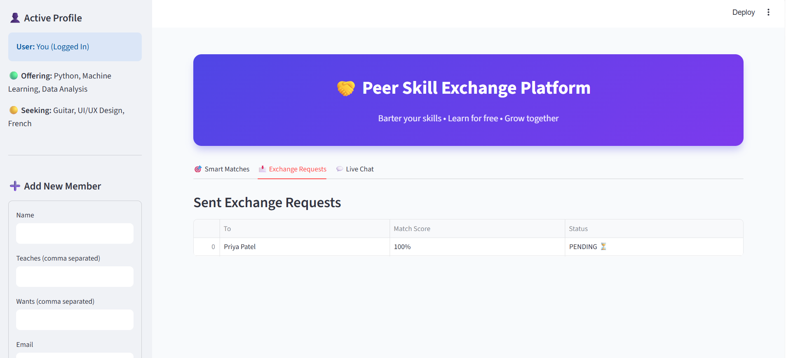
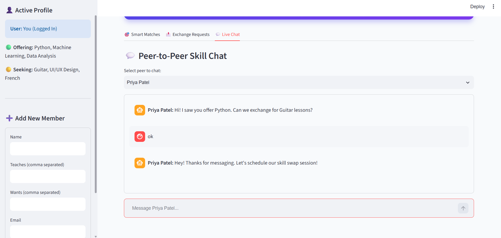

# 🤝 Student Skill Exchange Platform

## 📌 Project Description

The **Student Skill Exchange Platform** is a Streamlit-based web application
that helps students connect with other students to exchange skills and
knowledge.

Students can share the skills they can teach and the skills they want to
learn. The application uses a **Skill Match Algorithm** to calculate a
matching percentage between students and helps them find suitable skill
exchange partners.

The platform also provides exchange requests and a peer-to-peer chat feature
for communication.

---

## 🎯 Objectives

- Help students share their knowledge and skills.
- Allow students to discover peers with matching skills.
- Find suitable skill exchange partners automatically.
- Provide a simple way to send exchange requests.
- Enable students to communicate through live chat.
- Encourage peer-to-peer learning.

---

## ✨ Features

### 👤 Student Profile

The application displays the active student's profile with:

- Student name
- Skills they can teach
- Skills they want to learn

### 🎯 Smart Skill Matching

The application calculates a **Match Score** based on the overlap between:

- Skills offered by the current student
- Skills wanted by the current student
- Skills offered by another student
- Skills wanted by another student

Students are ranked according to their matching percentage.

### 🔄 Exchange Requests

Students can send a **Request Swap** request to another student.

The request contains:

- Student name
- Match score
- Request status

### 💬 Live Chat

Students can select a peer and communicate through the built-in chat
interface.

The chat supports:

- Selecting a peer
- Sending messages
- Displaying sent messages
- Displaying peer responses
- Separate conversations for different peers

### ➕ Add New Member

A new student can be added using the sidebar form.

The form accepts:

- Name
- Skills they teach
- Skills they want to learn
- Email address

---

## 🧠 Skill Match Algorithm

The application compares the skills of two students.

### Example

Student A:

**Offers:**
- Python
- Machine Learning

**Wants:**
- Guitar
- French

Student B:

**Offers:**
- Guitar
- French

**Wants:**
- Python

The algorithm identifies common skills between what one student wants to
learn and what the other student can teach.

A matching score is then calculated and displayed as a percentage.

---

## 🛠️ Technologies Used

- **Python**
- **Streamlit**
- **Pandas**

### Python Libraries
### Python Libraries

- `streamlit`
- `pandas`

---
# 🖥️ Application Screenshots

### 🎯 Smart Matches

### 📩 Exchange Requests

### 💬 Live Chat

